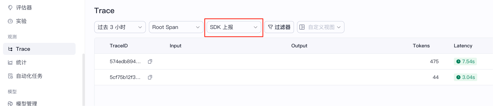

# How to Run

# Set global environment variable
- COZELOOP_WORKSPACE_ID=your workspace id
- COZELOOP_API_TOKEN=your pat or sat token
- PUBLISHED_BOT_ID
- USER_ID

COZELOOP_WORKSPACE_ID is spaceID in cozeloop, from https://loop.coze.cn/

COZELOOP_API_TOKEN is pat or sat token, which has permissions of 'ingestLoopTrace' and 'chat' for ingest trace and chat with bot

PUBLISHED_BOT_ID is your bot id, which has been published to API in coze

USER_ID is custom business user_id

reference coze develop doc: https://loop.coze.cn/open/docs/developer_guides/chat_v3

and then, you should check trace in 'SDK上报':
