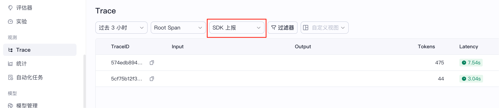

# How to Run

# Set global environment variable
- COZELOOP_WORKSPACE_ID=your workspace id
- COZELOOP_API_TOKEN=your pat or sat token
- WORKFLOW_ID
- PUBLISHED_BOT_ID

COZELOOP_WORKSPACE_ID is spaceID, from https://loop.coze.cn/

COZELOOP_API_TOKEN is pat or sat token, which has permissions of 'ingestLoopTrace' and 'run' for ingest trace and chat with workflow

WORKFLOW_ID is published workflow_id

PUBLISHED_BOT_ID is your bot id

reference coze develop doc: https://loop.coze.cn/open/docs/developer_guides/workflow_chat

and then, you should check trace in 'SDK上报':

